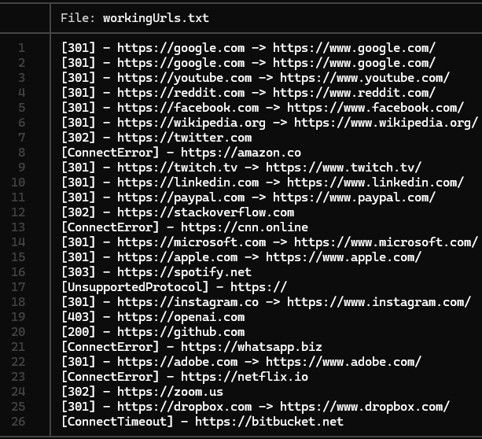

# WebScannerTool-linux
Python-developed web scanner tool. Helps analizing multiple web url's by its response codes.  
  
## Main features:

- Concurrent scanning with multiple threads (`ThreadPoolExecutor`) -
- HTTP response code filtering (200, 403, etc.)
- Automatic saving of results
- Option `--forcehttp` to prepend `https://` to URLs
- `--verbose` mode for detailed output
- Progress bar when verbose mode is not activated

*Requirements: Python 3.8+, libraries: httpx, tqdm.*  
  
Web Scanner is a python-developed tool that allows you to scan multiple URLs efficiently using multiple threads. Its main objective is verify the availability and response status of webs, filtering by it's HTTP codes and generating a report of results.  
  
## Installation:  
1. git clone https://github.com/franlumer/WebScannerTool-linux.git
2. cd WebScannerTool-linux    
3. pip install -r requirements.txt

## Ussage:  
Input file:  

Command:  

Result:  

# Extras

Currently using httpx with HTTP / 1.1 (support for HTTP / 2 could be added in future versions).  
If the output file already exists, it is automatically overwritten.

